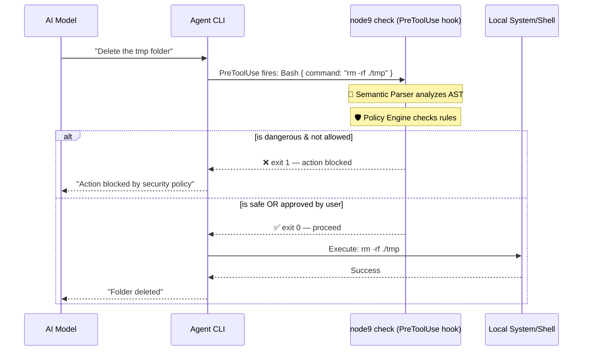
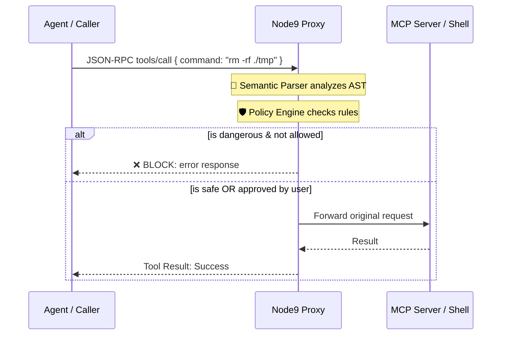

# 🛡️ Node9 Proxy

### The "Sudo" Command for AI Agents.

[](https://www.npmjs.com/package/@node9/proxy)
[](https://opensource.org/licenses/MIT)

**Node9** is the execution security layer for the Agentic Era. It intercepts AI agent actions — via native hooks (Claude Code, Gemini CLI, Cursor) or a JSON-RPC proxy (MCP servers, shell commands) — before they reach your production environment.

While others try to _guess_ if a prompt is malicious (Semantic Security), Node9 _intercepts_ the actual action (Execution Security).

## 🗺️ Architecture

Node9 has two protection modes. The right one depends on your agent:

| Agent          | Mode      | How                                                      |
| -------------- | --------- | -------------------------------------------------------- |
| Claude Code    | **Hook**  | `node9 addto claude` — hooks fire before every tool call |
| Gemini CLI     | **Hook**  | `node9 addto gemini` — hooks fire before every tool call |
| Cursor         | **Hook**  | `node9 addto cursor` — hooks fire before every tool call |
| MCP Servers    | **Proxy** | `node9 "npx <server>"` — JSON-RPC interceptor            |
| Shell commands | **Proxy** | `node9 "rm -rf ./data"` — evaluates before running       |

> ⚠️ **`node9 gemini` and `node9 claude` do NOT work** — interactive CLIs need a real TTY and communicate via their own hook system, not JSON-RPC. Use `node9 addto` for one-time setup, then run the agent normally.

### Hook Mode (Claude Code, Gemini CLI, Cursor)


```mermaid
sequenceDiagram
    participant LLM as AI Model
    participant Agent as Agent CLI
    participant Hook as node9 check (PreToolUse hook)
    participant OS as Local System/Shell

    LLM->>Agent: "Delete the tmp folder"
    Agent->>Hook: PreToolUse fires: Bash { command: "rm -rf ./tmp" }

    Note over Hook: 🧠 Semantic Parser analyzes AST
    Note over Hook: 🛡️ Policy Engine checks rules

    alt is dangerous & not allowed
        Hook-->>Agent: ❌ exit 1 — action blocked
        Agent-->>LLM: "Action blocked by security policy"
    else is safe OR approved by user
        Hook-->>Agent: ✅ exit 0 — proceed
        Agent->>OS: Execute: rm -rf ./tmp
        OS-->>Agent: Success
        Agent-->>LLM: "Folder deleted"
    end
```

### Proxy Mode (MCP Servers & shell commands)


```mermaid
sequenceDiagram
    participant Agent as Agent / Caller
    participant Node9 as Node9 Proxy
    participant MCP as MCP Server / Shell

    Agent->>Node9: JSON-RPC tools/call { command: "rm -rf ./tmp" }

    Note over Node9: 🧠 Semantic Parser analyzes AST
    Note over Node9: 🛡️ Policy Engine checks rules

    alt is dangerous & not allowed
        Node9-->>Agent: ❌ BLOCK: error response
    else is safe OR approved by user
        Node9->>MCP: Forward original request
        MCP-->>Node9: Result
        Node9-->>Agent: Tool Result: Success
    end
```

---

## 🛑 The Problem: Agent Liability

In 2026, AI agents have "Write Access" to everything (GitHub, AWS, Stripe, Databases).

- **The Risk:** An agent hallucinating a `DROP DATABASE` or an unauthorized `aws.delete_instance`.
- **The Solution:** Node9 intercepts high-risk tool calls and pauses execution until a human provides a signature.

## 🚀 Key Features

- **Deterministic "Sudo" Mode:** Intercepts dangerous tool calls based on hardcoded policies.
- **Human-in-the-Loop (HITL):** Requires explicit approval via the **Terminal** (Local) or **Slack** (Cloud).
- **One-Command Setup:** `node9 addto claude` wires up full protection in seconds — no manual config editing.
- **MCP Native:** Deep-packet inspection of JSON-RPC traffic. Protects any Model Context Protocol server.
- **Hook Native:** Plugs into Claude Code, Gemini CLI, and Cursor's native hook systems to intercept built-in tools (Bash, Write, Edit) — not just MCP calls.
- **Global Config:** Store your security posture in a `node9.config.json` file in your project root.

---

## 📦 Installation

```bash
npm install -g @node9/proxy
```

---

## ⚡ Quick Start

Node9 provides two layers of protection depending on the agent you use:

### 1. Hook-Based Protection (For Interactive Agents)

Interactive CLIs like **Gemini**, **Claude Code**, and **Cursor** require a real terminal. Use the `addto` command to wire up Node9's native hooks:

```bash
# One-time setup
node9 addto gemini
node9 addto claude
node9 addto cursor

# Then run your agent normally! Node9 protection is now automatic.
gemini
claude
```

### 2. Proxy-Based Protection (For MCP & Shell)

For standalone MCP servers or one-off shell commands, use the **Smart Runner** prefix:

```bash
# Intercepts 'rm -rf /' before starting
node9 "rm -rf /"

# Wraps an MCP server with a security proxy
node9 "npx @modelcontextprotocol/server-github"
```

_Note: Always wrap the target command in quotes._

---

## 🛠 Usage

### 1. Connect to Node9 Cloud (Optional)

To route approvals to **Slack** when you are away from your terminal, login once with your API key:

```bash
node9 login <your_api_key>
```

_Your credentials are stored in `~/.node9/credentials.json` with `0o600` permissions (owner read/write only)._

### 2. One-Command Agent Setup

`node9 addto <target>` wires up Node9 to your AI agent automatically:

| Target   | MCP Servers | Built-in Tools (Bash, Write, Edit...) | Audit Log |
| -------- | :---------: | :-----------------------------------: | :-------: |
| `claude` |     ✅      |       ✅ via `PreToolUse` hook        |    ✅     |
| `gemini` |     ✅      |       ✅ via `BeforeTool` hook        |    ✅     |
| `cursor` |     ✅      |       ✅ via `preToolUse` hook        |    ✅     |

**What it does under the hood:**

- Wraps your existing MCP servers with `node9 proxy` (asks for confirmation first)
- Adds a pre-execution hook → `node9 check` runs before every tool call
- Adds a post-execution hook → `node9 log` writes every executed action to `~/.node9/audit.log`

### 3. Local Approval Daemon (Browser UI)

For hook-based integrations, Node9 can auto-start a local browser UI to approve or deny dangerous actions without needing a Slack account.

```bash
# Start manually and keep it running in the background
node9 daemon --background

# Check status / stop
node9 daemon status
node9 daemon stop
```

**How it works:**

- When a dangerous tool call arrives and the daemon is running, Node9 routes it to `http://127.0.0.1:7391` and opens your browser.
- If the daemon is **not** running, Node9 auto-starts it and opens the browser automatically (default behaviour).
- If you **close the browser tab** without approving or denying, Node9 waits 2 seconds (to allow for an accidental refresh), then abandons the request and falls back to a terminal prompt.
- After a browser-close abandonment, the daemon shuts down automatically so the next command goes back to the same auto-start flow.

**Settings (in the browser UI ⚙️):**

| Setting           | Default | Effect                                                                              |
| ----------------- | ------- | ----------------------------------------------------------------------------------- |
| Auto-start daemon | **On**  | Start the daemon + open browser automatically when no approval mechanism is running |

Turn "Auto-start daemon" **off** if you prefer to always be asked in the terminal, or if you want to control the daemon lifecycle manually.

You can also disable auto-start permanently via `~/.node9/config.json`:

```json
{
  "settings": {
    "mode": "standard",
    "autoStartDaemon": false
  }
}
```

### 4. Manual Command & MCP Protection

To protect any command or MCP server manually:

**Protecting a direct command:**

```bash
node9 "rm -rf ./data"
```

**Protecting GitHub MCP Server:**

```bash
node9 "npx @modelcontextprotocol/server-github"
```

**Note:** Direct proxying (e.g. `node9 gemini`) is not supported for interactive agents. Use `node9 addto` instead.

### 4. SDK — Protect Functions in Your Own Code

Wrap any async function with `protect()` to require human approval before it runs:

```typescript
import { protect } from '@node9/proxy';

const deleteDatabase = protect('aws.rds.delete_database', async (name: string) => {
  // ... actual deletion logic
});

// Node9 intercepts this and prompts for approval before running
await deleteDatabase('production-db-v1');
```

---

## ⚙️ Configuration (`node9.config.json`)

Add a `node9.config.json` to your project root or `~/.node9/config.json` for global use.

```json
{
  "settings": {
    "mode": "standard"
  },
  "policy": {
    "dangerousWords": ["delete", "drop", "terminate", "rm", "rmdir"],
    "ignoredTools": ["list_*", "get_*", "read_*"],
    "toolInspection": {
      "bash": "command",
      "shell": "command",
      "run_shell_command": "command"
    },
    "rules": [
      {
        "action": "rm",
        "allowPaths": ["**/node_modules/**", "dist/**", "build/**"]
      }
    ]
  },
  "environments": {
    "production": {
      "requireApproval": true,
      "slackChannel": "#alerts-prod-security"
    },
    "development": {
      "requireApproval": false
    }
  }
}
```

**Modes:**

- `standard`: Allows everything except tools containing `dangerousWords`.
- `strict`: Blocks **everything** except tools listed in `ignoredTools`.

**Environment overrides** (keyed by `NODE_ENV`):

- `requireApproval: false` — auto-allow all actions in that environment (useful for local dev).
- `slackChannel` — route cloud approvals to a specific Slack channel for that environment.

### 🔌 Universal Tool Inspection (The "Universal Adapter")

Node9 can protect **any** tool, even if it's not Claude or Gemini. You can tell Node9 where to find the "dangerous" payload in any tool call.

Example: Protecting a custom "Stripe" MCP server:

```json
"toolInspection": {
  "stripe.send_refund": "amount",
  "github.delete*": "params.repo_name"
}
```

Now, whenever your agent calls `stripe.send_refund`, Node9 will extract the `amount` and check it against your global security policy.

---

## 🛡️ How it Works

Node9 is **deterministic**. It doesn't use AI to check AI.

### Hook Mode (via `node9 addto`)

```
Claude wants to run Bash("rm -rf /data")
          │
    PreToolUse hook fires
    → node9 check
          │
     ┌────┴─────┐
     │ BLOCKED  │  → Claude is told the action was denied
     └──────────┘
          OR
     ┌──────────┐
     │ APPROVED │  → Claude runs the command
     └──────────┘
          │
    PostToolUse hook fires
    → node9 log  → appended to ~/.node9/audit.log
```

### Proxy Mode (via `node9 "<command>"`)

```
1. Intercept  — catches the JSON-RPC tools/call request mid-flight
2. Evaluate   — checks against your local node9.config.json
3. Suspend    — execution is frozen in a PENDING state
4. Authorize  — Local: prompt in terminal / Cloud: button in Slack
5. Release    — command forwarded to the target only after approval
```

---

## 🔧 Troubleshooting

**`node9 check` exits immediately / Claude Code is never blocked**

Node9 fails open by design — if it can't parse the hook payload it exits 0 rather than blocking your agent. Enable debug logging to see what's happening:

```bash
NODE9_DEBUG=1 claude   # logs every hook payload to ~/.node9/hook-debug.log
```

**Browser opens on every single tool call**

The daemon opens the browser only when no tab is already connected. If your browser keeps opening, check that the previous tab is still open. If you'd prefer the terminal prompt instead, disable auto-start in the daemon UI (⚙️ Settings → Auto-start daemon: Off).

**`node9 daemon stop` says "Not running" even though I see the process**

The daemon PID file may be stale. Run `rm ~/.node9/daemon.pid` and try again.

**Terminal prompt never appears — action is just blocked**

The terminal prompt only shows when `process.stdout` is a TTY (i.e. you're running directly in a terminal, not through a pipe). If you're using the hook system (`node9 check`), it runs headless. Start the daemon to get a browser prompt instead:

```bash
node9 daemon --background
```

**"Always Allow" / "Always Deny" not taking effect after restart**

Persistent decisions are stored in `~/.node9/decisions.json`. If a project `node9.config.json` overrides the `ignoredTools` list in a way that covers the tool, it may be allowed before the decisions file is checked. Look at the config precedence: project config → global config → defaults.

---

## 📈 Roadmap

- [x] Local Terminal "Sudo" (OSS)
- [x] MCP JSON-RPC Interceptor
- [x] Slack Remote Approvals (Pro)
- [x] One-command setup (`node9 addto claude/gemini/cursor`)
- [x] Hook-native integration (PreToolUse / BeforeTool / preToolUse)
- [x] Audit log (`~/.node9/audit.log`)
- [ ] **Multi-Admin Quorum** (Approve only if 2 admins click)
- [ ] **SOC2 Tamper-proof Audit Logs** (Enterprise)

---

## 🏢 Enterprise & Commercial Use

The local proxy is free forever for individual developers. For teams requiring **Slack Integration**, **VPC Deployment**, and **Tamper-proof Audit Logs**, visit [node9.ai](https://node9.ai) or contact `support@node9.ai`.

---

**Safe Agentic Automations Start with Node9.** 🛡️🚀
