# 🛡️ Node9 Proxy
### The "Sudo" Command for AI Agents.

[](https://www.npmjs.com/package/@node9/proxy)
[](https://opensource.org/licenses/MIT)

**Node9** is the execution security layer for the Agentic Era. It acts as a deterministic "Sudo" proxy between AI Agents (Claude Code, Gemini CLI, Cursor, MCP Servers) and your production environment.

While others try to *guess* if a prompt is malicious (Semantic Security), Node9 *intercepts* the actual action (Execution Security).

## 🗺️ Architecture

```mermaid
sequenceDiagram
    participant LLM as AI Model (Gemini/Claude)
    participant Agent as Agent CLI (Gemini/Claude Code)
    participant Node9 as Node9 Proxy
    participant OS as Local System/Shell

    LLM->>Agent: "Delete the tmp folder"
    Agent->>Node9: Tool Call: Shell { command: "rm -rf ./tmp" }
    
    Note over Node9: 🧠 Semantic Parser analyzes AST
    Note over Node9: 🛡️ Policy Engine checks rules
    
    alt is dangerous & not allowed
        Node9-->>Agent: ❌ BLOCK: Decision denied
        Agent-->>LLM: "Action blocked by security policy"
    else is safe OR approved by user
        Node9->>OS: Execute: rm -rf ./tmp
        OS-->>Node9: Success
        Node9-->>Agent: Tool Result: Success
        Agent-->>LLM: "Folder deleted"
    end
```



---

## 🛑 The Problem: Agent Liability
In 2026, AI agents have "Write Access" to everything (GitHub, AWS, Stripe, Databases).
- **The Risk:** An agent hallucinating a `DROP DATABASE` or an unauthorized `aws.delete_instance`.
- **The Solution:** Node9 intercepts high-risk tool calls and pauses execution until a human provides a signature.

## 🚀 Key Features
- **Deterministic "Sudo" Mode:** Intercepts dangerous tool calls based on hardcoded policies.
- **Human-in-the-Loop (HITL):** Requires explicit approval via the **Terminal** (Local) or **Slack** (Cloud).
- **One-Command Setup:** `node9 addto claude` wires up full protection in seconds — no manual config editing.
- **MCP Native:** Deep-packet inspection of JSON-RPC traffic. Protects any Model Context Protocol server.
- **Hook Native:** Plugs into Claude Code, Gemini CLI, and Cursor's native hook systems to intercept built-in tools (Bash, Write, Edit) — not just MCP calls.
- **Global Config:** Store your security posture in a `node9.config.json` file in your project root.

---

## 📦 Installation

```bash
npm install -g @node9/proxy
```

---

## ⚡ Quick Start

The fastest way to get full protection is one command:

```bash
# Protect Claude Code (MCP servers + Bash/Write/Edit hooks)
node9 addto claude

# Protect Gemini CLI (BeforeTool / AfterTool hooks)
node9 addto gemini

# Protect Cursor
node9 addto cursor
```

### 🎯 The Smart Runner
You can now protect any command by simply prefixing it with `node9`:

```bash
# Intercepts 'rm -rf /' before starting
node9 "rm -rf /"

# Runs Gemini with full proxy & hook protection
node9 gemini
```
*Note: Always wrap the target command in quotes to avoid argument conflicts.*

Node9 will show you exactly what it's about to change and ask for confirmation before touching any config file.

---

## 🛠 Usage

### 1. Connect to Node9 Cloud (Optional)
To route approvals to **Slack** when you are away from your terminal, login once with your API key:

```bash
node9 login <your_api_key>
```
*Your credentials are stored securely in `~/.node9/credentials.json`.*

### 2. One-Command Agent Setup

`node9 addto <target>` wires up Node9 to your AI agent automatically:

| Target | MCP Servers | Built-in Tools (Bash, Write, Edit...) | Audit Log |
|--------|:-----------:|:-------------------------------------:|:---------:|
| `claude` | ✅ | ✅ via `PreToolUse` hook | ✅ |
| `gemini` | ✅ | ✅ via `BeforeTool` hook | ✅ |
| `cursor` | ✅ | ✅ via `preToolUse` hook | ✅ |

**What it does under the hood:**
- Wraps your existing MCP servers with `node9 proxy` (asks for confirmation first)
- Adds a pre-execution hook → `node9 check` runs before every tool call
- Adds a post-execution hook → `node9 log` writes every executed action to `~/.node9/audit.log`

### 3. Manual Command & MCP Protection

To protect any command or MCP server manually:

**Protecting the Gemini CLI:**
```bash
node9 gemini
```

**Protecting a direct command:**
```bash
node9 "rm -rf ./data"
```

**Protecting GitHub MCP Server:**
```bash
node9 "npx @modelcontextprotocol/server-github"
```

### 4. SDK — Protect Functions in Your Own Code

Wrap any async function with `protect()` to require human approval before it runs:

```typescript
import { protect } from '@node9/proxy';

const deleteDatabase = protect('aws.rds.delete_database', async (name: string) => {
  // ... actual deletion logic
});

// Node9 intercepts this and prompts for approval before running
await deleteDatabase('production-db-v1');
```

---

## ⚙️ Configuration (`node9.config.json`)
Add a `node9.config.json` to your project root or `~/.node9/config.json` for global use.

```json
{
  "settings": {
    "mode": "standard"
  },
  "policy": {
    "dangerousWords": ["delete", "drop", "terminate", "rm", "rmdir"],
    "ignoredTools": ["list_*", "get_*", "read_*"],
    "toolInspection": {
      "bash": "command",
      "shell": "command",
      "run_shell_command": "command"
    },
    "rules": [
      {
        "action": "rm",
        "allowPaths": ["**/node_modules/**", "dist/**", "build/**"]
      }
    ]
  },
  "environments": {
    "production": {
      "requireApproval": true,
      "slackChannel": "#alerts-prod-security"
    },
    "development": {
      "requireApproval": false
    }
  }
}
```

**Modes:**
- `standard`: Allows everything except tools containing `dangerousWords`.
- `strict`: Blocks **everything** except tools listed in `ignoredTools`.

**Environment overrides** (keyed by `NODE_ENV`):
- `requireApproval: false` — auto-allow all actions in that environment (useful for local dev).
- `slackChannel` — route cloud approvals to a specific Slack channel for that environment.

### 🔌 Universal Tool Inspection (The "Universal Adapter")
Node9 can protect **any** tool, even if it's not Claude or Gemini. You can tell Node9 where to find the "dangerous" payload in any tool call.

Example: Protecting a custom "Stripe" MCP server:
```json
"toolInspection": {
  "stripe.send_refund": "amount",
  "github.delete*": "params.repo_name"
}
```
Now, whenever your agent calls `stripe.send_refund`, Node9 will extract the `amount` and check it against your global security policy.

---

## 🛡️ How it Works
Node9 is **deterministic**. It doesn't use AI to check AI.

### Hook Mode (via `node9 addto`)
```
Claude wants to run Bash("rm -rf /data")
          │
    PreToolUse hook fires
    → node9 check
          │
     ┌────┴─────┐
     │ BLOCKED  │  → Claude is told the action was denied
     └──────────┘
          OR
     ┌──────────┐
     │ APPROVED │  → Claude runs the command
     └──────────┘
          │
    PostToolUse hook fires
    → node9 log  → appended to ~/.node9/audit.log
```

### Proxy Mode (via `node9 proxy`)
```
1. Intercept  — catches the JSON-RPC tools/call request mid-flight
2. Evaluate   — checks against your local node9.config.json
3. Suspend    — execution is frozen in a PENDING state
4. Authorize  — Local: prompt in terminal / Cloud: button in Slack
5. Release    — command forwarded to the target only after approval
```

---

## 📈 Roadmap
- [x] Local Terminal "Sudo" (OSS)
- [x] MCP JSON-RPC Interceptor
- [x] Slack Remote Approvals (Pro)
- [x] One-command setup (`node9 addto claude/gemini/cursor`)
- [x] Hook-native integration (PreToolUse / BeforeTool / preToolUse)
- [x] Audit log (`~/.node9/audit.log`)
- [ ] **Multi-Admin Quorum** (Approve only if 2 admins click)
- [ ] **SOC2 Tamper-proof Audit Logs** (Enterprise)

---

## 🏢 Enterprise & Commercial Use
The local proxy is free forever for individual developers. For teams requiring **Slack Integration**, **VPC Deployment**, and **Tamper-proof Audit Logs**, visit [node9.ai](https://node9.ai) or contact `support@node9.ai`.

---

**Safe Agentic Automations Start with Node9.** 🛡️🚀
